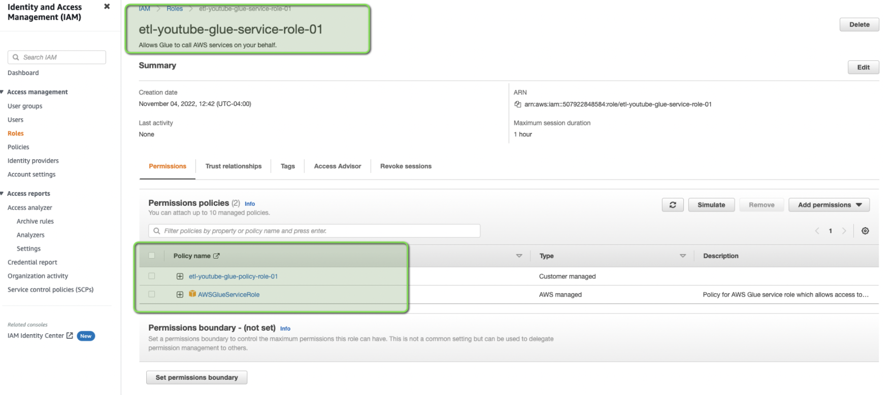
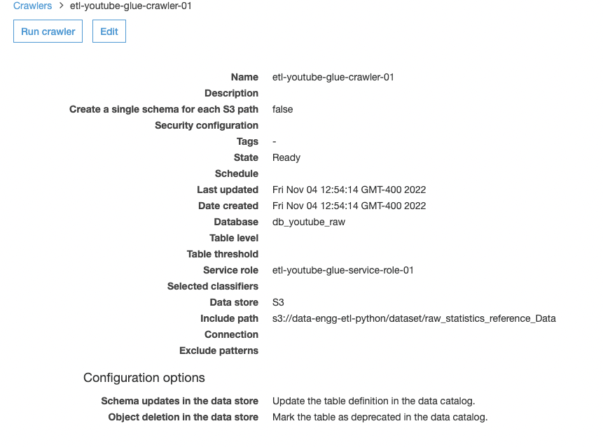
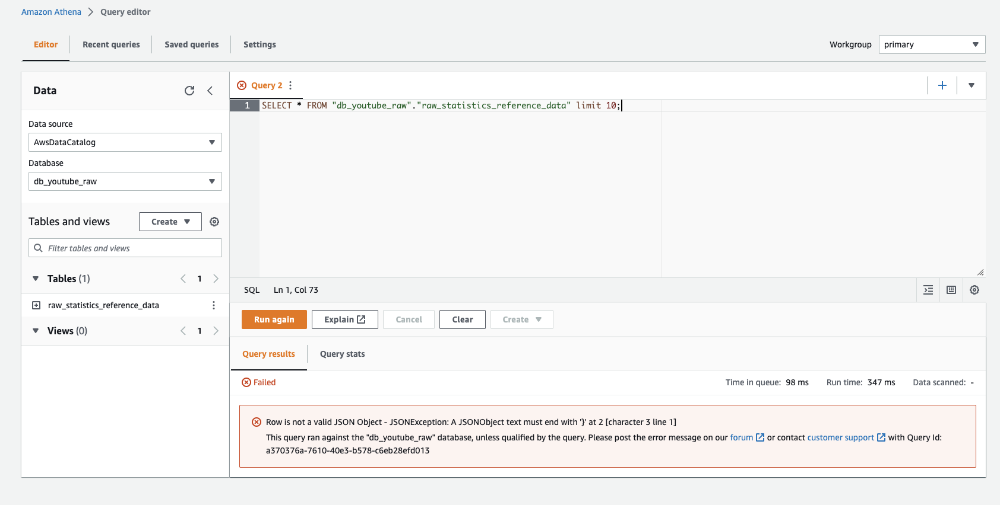
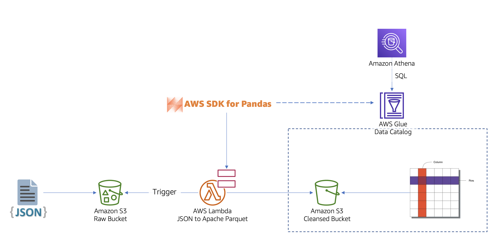
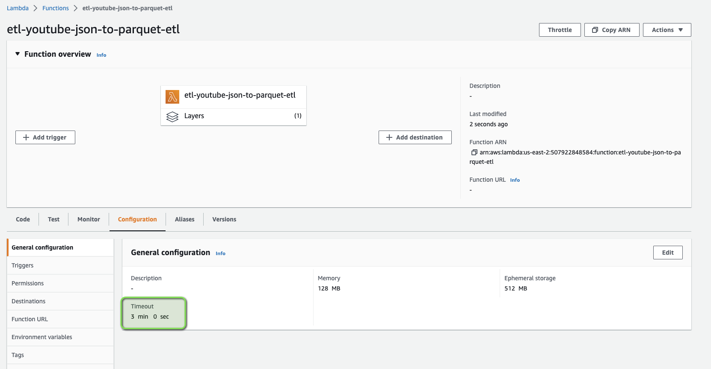
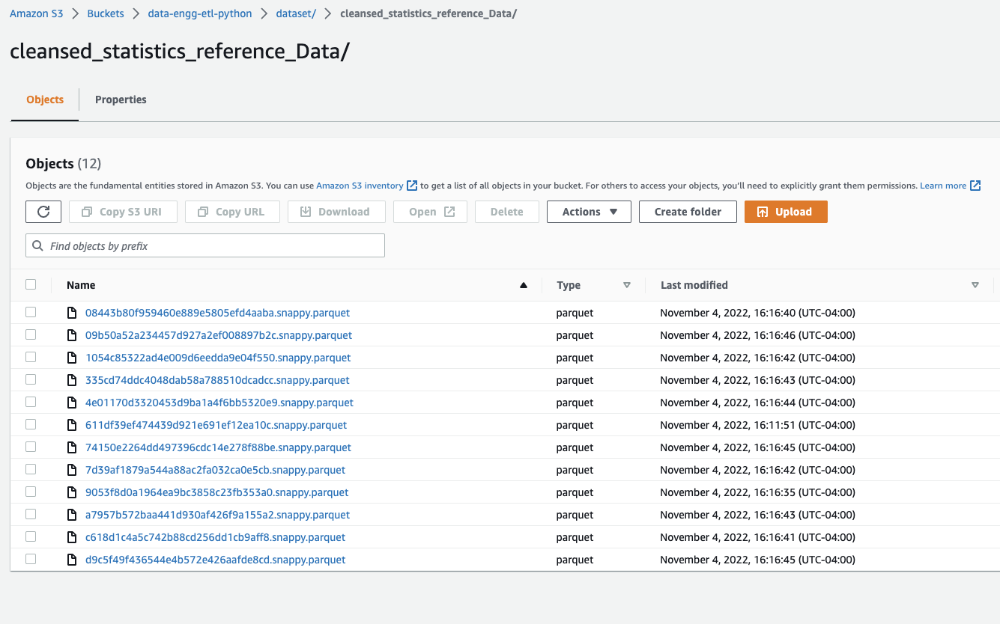
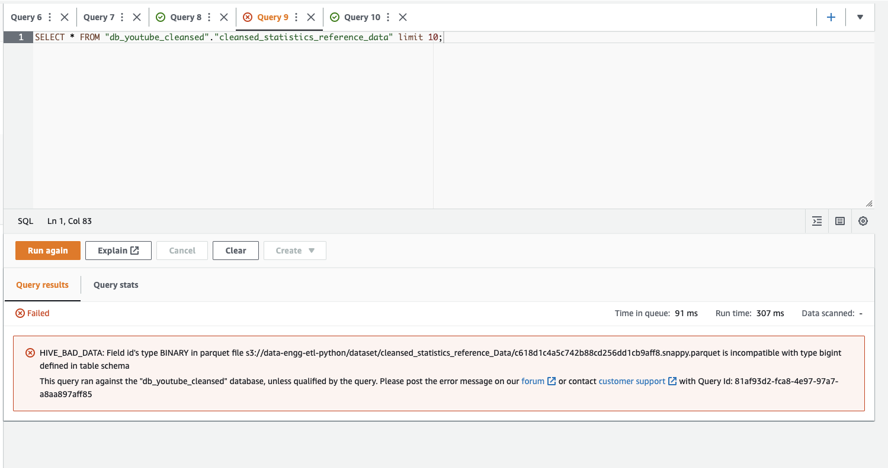
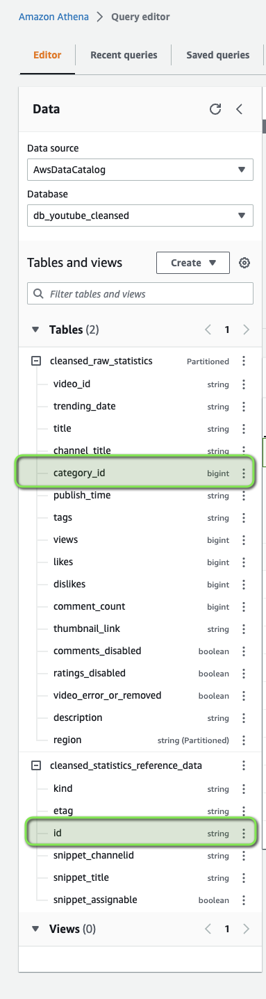
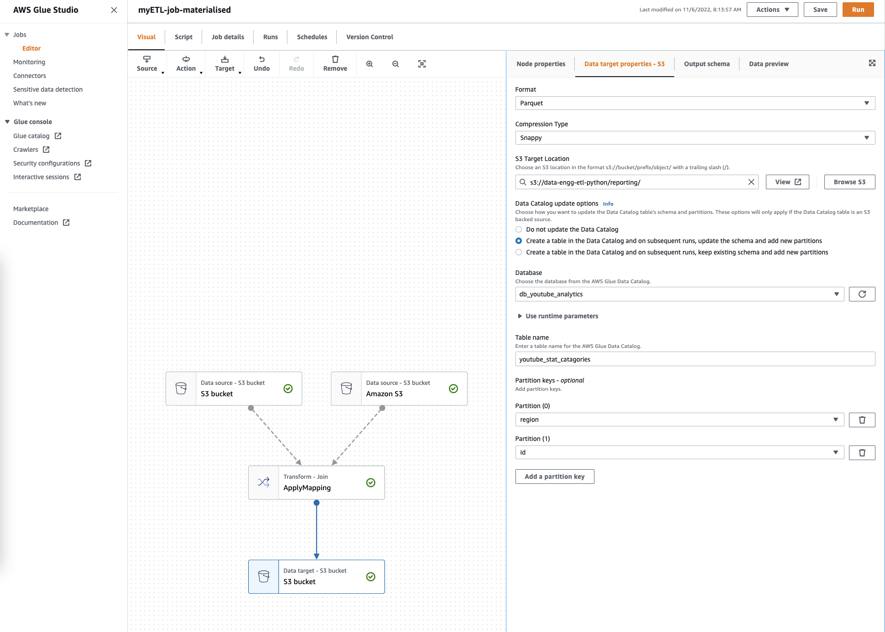
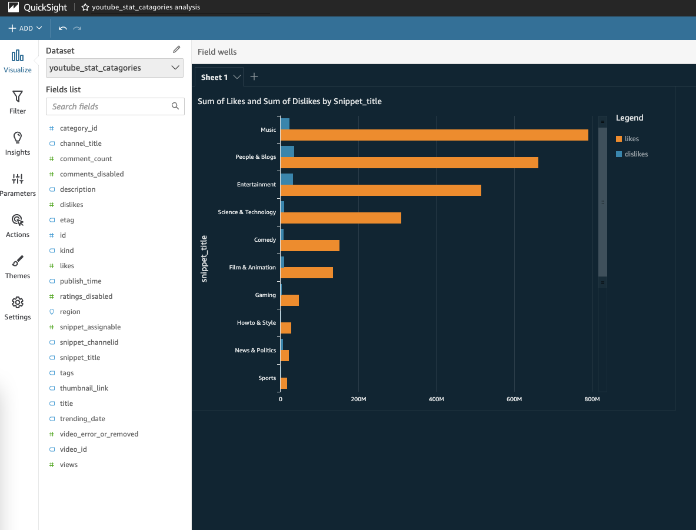

# Building ETL Data Pipeline in Python on AWS 

In this workshop we will build a complete pipeline of data pipeline and build a data lake from scratch in Amazon S3 and shall joining semi-structured and structured data. And we will do that by analysing [YouTube video statistics data](https://www.kaggle.com/datasets/datasnaek/youtube-new) by cleaning, processing and finally analuzing the data in an automated and optimized way. 

During this process we will learn the following AWS services and PySpark:

1. Amazon S3 
2. AWS Glue 
3. AWS Glue Studio
4. Amazon Athena 
5. Amazon Quicksight
6. AWS SDK for Python 


## Download the dataset

Download the dataset from [Kaggle Trending YouTube Video Statistics](https://www.kaggle.com/datasets/datasnaek/youtube-new) dataset 

```bash
## Install kaggle cli [OPTIONAL]

pip install kaggle
mkdir ~/.kaggle
mv ~/Download/kaggle.json ~/.kaggle/kaggle.json
chmod 600 ~/.kaggle/kaggle.json

## Download the dataset 

kaggle datasets download -d datasnaek/youtube-new
unzip youtube-new.zip -d youtube-new
```

## Creating an S3 bucket

This is the S3 location where we will store the RAW data, 
- Name of the Bucket : `data-engg-etl-python` 

```bash

# S3 location = s3://data-engg-etl-python/dataset/YouTubeDataset/

aws s3 mb s3://data-engg-etl-python --region us-east-2

cd youtube-new
aws s3 cp CAvideos.csv s3://data-engg-etl-python/dataset/raw_statistics/region=ca/
aws s3 cp DEvideos.csv s3://data-engg-etl-python/dataset/raw_statistics/region=de/
aws s3 cp FRvideos.csv s3://data-engg-etl-python/dataset/raw_statistics/region=fr/
aws s3 cp GBvideos.csv s3://data-engg-etl-python/dataset/raw_statistics/region=gb/
aws s3 cp JJPvideos.csv s3://data-engg-etl-python/dataset/raw_statistics/region=jp/
aws s3 cp KRvideos.csv s3://data-engg-etl-python/dataset/raw_statistics/region=kr/
aws s3 cp MXvideos.csv s3://data-engg-etl-python/dataset/raw_statistics/region=mx/
aws s3 cp RUvideos.csv s3://data-engg-etl-python/dataset/raw_statistics/region=ru/
aws s3 cp USvideos.csv s3://data-engg-etl-python/dataset/raw_statistics/region=us/

aws s3 cp CA_category_id.json s3://data-engg-etl-python/dataset/raw_statistics_reference_Data/ 
aws s3 cp DE_category_id.json s3://data-engg-etl-python/dataset/raw_statistics_reference_Data/ 
aws s3 cp FR_category_id.json s3://data-engg-etl-python/dataset/raw_statistics_reference_Data/ 
aws s3 cp GB_category_id.json s3://data-engg-etl-python/dataset/raw_statistics_reference_Data/ 
aws s3 cp IN_category_id.json s3://data-engg-etl-python/dataset/raw_statistics_reference_Data/ 
aws s3 cp JP_category_id.json s3://data-engg-etl-python/dataset/raw_statistics_reference_Data/ 
aws s3 cp KR_category_id.json s3://data-engg-etl-python/dataset/raw_statistics_reference_Data/ 
aws s3 cp MX_category_id.json s3://data-engg-etl-python/dataset/raw_statistics_reference_Data/ 
aws s3 cp RU_category_id.json s3://data-engg-etl-python/dataset/raw_statistics_reference_Data/ 
aws s3 cp US_category_id.json s3://data-engg-etl-python/dataset/raw_statistics_reference_Data/

```

## Create a AWS Glue Data Crawling 


1. Create an IAM Service role for AWS Glue 
    - Role Name : `etl-youtube-glue-service-role-01` 
    - Create an IAM Policy for Glue to access S3 bucket
    - Policy Name : `etl-youtube-glue-policy-role-01`



2. Create a crawler for the raw statistics reference data 
    - Name : `etl-youtube-glue-crawler-01`
    - Database Name : `db_youtube_raw`




3. View data, and it will throw an error 




This is beacuse Athena is not able to read the data, and this is where we will learn about `Serializer and Deserializer` (JSON for ETL) and how we can clean the data

## Build the ETL Pipeline to transform JSON to Parquet (Data Cleaning)

Tools that we are going to use to clean this data are:

1. AWS Lambda 
2. AWS Data Wrangler 
3. Amazon S3



1. Create an S3 bucket
   In our case we will create a folder under an existing bucket
    - Bucket Name: `s3://data-engg-etl-python/dataset/cleansed_statistics_reference_Data/`
        
2. Create an IAM Policy (This is will used by Lambda Role later)
    - Name of the Policy `etl-youtube-kaggle-process-read-write-on-s3-policy`
    - Have access to the raw dataset bucket and the newly created cleansed bucket

3. Create Lambda function 
    - Name of the Lambda function : `etl-youtube-json-to-parquet-etl` 
    - Runtime : `Python 3.8`

4. Once the lambda function is created, attached the previously created `IAM Policy` to this function
    - IAM Policy : `etl-youtube-kaggle-process-read-write-on-s3-policy` 
    - IAM Policy : `AWSGlueServiceRole` (This is the default role)

5. Set the following ENV variable for the lambda function 

```
s3_cleansed_layer = s3://data-engg-etl-python/dataset/cleansed_statistics_reference_Data/
glue_catalog_db_name = db_youtube_cleansed
glue_catalog_table_name = cleansed_statistics_reference_data
write_data_operation = append
```

6. Add a lambda layer to the Lambda Function 
    Name of the Lambda Layer : `AWSSDKPandas-Python38`

7. Create a Glue Table, as that is going to be used by AWS SDK for Pandas while cleaning the data and storing it to S3 

    - Name of the table : `db_youtube_cleansed` 

Here is the lambda function, 

```python

import awswrangler as wr
import pandas as pd
import urllib.parse
import os

# Temporary hard-coded AWS Settings; i.e. to be set as OS variable in Lambda
os_input_s3_cleansed_layer = os.environ['s3_cleansed_layer']
os_input_glue_catalog_db_name = os.environ['glue_catalog_db_name']
os_input_glue_catalog_table_name = os.environ['glue_catalog_table_name']
os_input_write_data_operation = os.environ['write_data_operation']


def lambda_handler(event, context):
    # Get the object from the event and show its content type
    bucket = event['Records'][0]['s3']['bucket']['name']
    key = urllib.parse.unquote_plus(event['Records'][0]['s3']['object']['key'], encoding='utf-8')
    try:

        # Creating DF from content
        df_raw = wr.s3.read_json('s3://{}/{}'.format(bucket, key))

        # Extract required columns:
        df_step_1 = pd.json_normalize(df_raw['items'])

        # Write to S3
        wr_response = wr.s3.to_parquet(
            df=df_step_1,
            path=os_input_s3_cleansed_layer,
            dataset=True,
            database=os_input_glue_catalog_db_name,
            table=os_input_glue_catalog_table_name,
            mode=os_input_write_data_operation
        )

        return wr_response
    except Exception as e:
        print(e)
        print('Error getting object {} from bucket {}. Make sure they exist and your bucket is in the same region as this function.'.format(key, bucket))
        raise e

```

Change the Lambda time out to 3 mins from 3 seconds 



8. Add the S3 trigger:
    - Name of the bucket : `etl-youtube-json-to-parquet-etl`
    - Key Prefix : `dataset/raw_statistics_reference_Data/`
    - Type : PUT
9. Now we can trigger the Lambda function by copying the file on S3 

```
aws s3 cp CA_category_id.json s3://data-engg-etl-python/dataset/raw_statistics_reference_Data/ 
aws s3 cp DE_category_id.json s3://data-engg-etl-python/dataset/raw_statistics_reference_Data/ 
aws s3 cp FR_category_id.json s3://data-engg-etl-python/dataset/raw_statistics_reference_Data/ 
aws s3 cp GB_category_id.json s3://data-engg-etl-python/dataset/raw_statistics_reference_Data/ 
aws s3 cp IN_category_id.json s3://data-engg-etl-python/dataset/raw_statistics_reference_Data/ 
aws s3 cp JP_category_id.json s3://data-engg-etl-python/dataset/raw_statistics_reference_Data/ 
aws s3 cp KR_category_id.json s3://data-engg-etl-python/dataset/raw_statistics_reference_Data/ 
aws s3 cp MX_category_id.json s3://data-engg-etl-python/dataset/raw_statistics_reference_Data/ 
aws s3 cp RU_category_id.json s3://data-engg-etl-python/dataset/raw_statistics_reference_Data/ 
aws s3 cp US_category_id.json s3://data-engg-etl-python/dataset/raw_statistics_reference_Data/

```
9. Check the cleansed data on S3 



10. Query using Athena 

```sql
SELECT * FROM "db_youtube_cleansed"."cleansed_statistics_reference_data" limit 10;
SELECT id, snippet_channelid FROM "db_youtube_cleansed"."cleansed_statistics_reference_data" limit 10;
```


## Analyze the historical data (BATCH Processing)

1. Create a crawler 
    - Name : `etl-youtube-glue-crawler-raw-stat-01`

2. Delete the old crawler which we created first which failed due to serializer

3. Now we can analyze the data 

```sql
SELECT * 
FROM "AwsDataCatalog"."db_youtube_raw"."raw_statistics" 
WHERE region='ca'
LIMIT 10;
```

4. Now we can explore the DDL which the crawler created unfer the hood to create the metastore. And you will see that this data has a seperate column called `region` which is not present in the raw CSV file in S3 

```sql
CREATE EXTERNAL TABLE `raw_statistics`(
  `video_id` string, 
  `trending_date` string, 
  `title` string, 
  `channel_title` string, 
  `category_id` bigint, 
  `publish_time` string, 
  `tags` string, 
  `views` bigint, 
  `likes` bigint, 
  `dislikes` bigint, 
  `comment_count` bigint, 
  `thumbnail_link` string, 
  `comments_disabled` boolean, 
  `ratings_disabled` boolean, 
  `video_error_or_removed` boolean, 
  `description` string)
PARTITIONED BY ( 
  `region` string)
ROW FORMAT DELIMITED 
  FIELDS TERMINATED BY ',' 
STORED AS INPUTFORMAT 
  'org.apache.hadoop.mapred.TextInputFormat' 
OUTPUTFORMAT 
  'org.apache.hadoop.hive.ql.io.HiveIgnoreKeyTextOutputFormat'
LOCATION
  's3://data-engg-etl-python/dataset/raw_statistics/'
TBLPROPERTIES (
  'CrawlerSchemaDeserializerVersion'='1.0', 
  'CrawlerSchemaSerializerVersion'='1.0', 
  'UPDATED_BY_CRAWLER'='etl-youtube-glue-crawler-raw-stat-01', 
  'areColumnsQuoted'='false', 
  'averageRecordSize'='728', 
  'classification'='csv', 
  'columnsOrdered'='true', 
  'commentCharacter'='#', 
  'compressionType'='none', 
  'delimiter'=',', 
  'objectCount'='8', 
  'recordCount'='618294', 
  'sizeKey'='450798125', 
  'skip.header.line.count'='1', 
  'typeOfData'='file')

```

## Configure AWS Glue Studio for data processing (ETL Job)

In this step we will convert the CSV data to parquet so that later on we can make some `JOIN` call between the `raw_statistics` and `cleansed_statistics_reference_data` 

1. Open AWS Glue Studio and Create a New Job

    - Job Name : `myETL-job-CVS-Parquet` 
    - Data Source S3 Bucket : `Data Catalog table`
    - Change the output schema definition (`long` → `bigint`) 
    - Database : `db_youtube_raw`
    - Table : `raw_statistics` 
    - Target S3 Bucket : `s3://data-engg-etl-python/dataset/cleansed_raw_statistics/` (Create this folder before, `cleansed_raw_statistics`) 
    - Job Details:

        - IAM Role : `etl-youtube-glue-service-role-01`
        - S3 Localtion : `s3://data-engg-etl-python/code/` (Create this folder before, `code`)

2. Here is the PySpark script for the ETL job

```python
import sys
from awsglue.transforms import *
from awsglue.utils import getResolvedOptions
from pyspark.context import SparkContext
from awsglue.context import GlueContext
from awsglue.job import Job

args = getResolvedOptions(sys.argv, ["JOB_NAME"])
sc = SparkContext()
glueContext = GlueContext(sc)
spark = glueContext.spark_session
job = Job(glueContext)
job.init(args["JOB_NAME"], args)

# Script generated for node S3 bucket
# S3bucket_node1 = glueContext.create_dynamic_frame.from_catalog(
#     database="db_youtube_raw",
#     table_name="raw_statistics",
#     transformation_ctx="S3bucket_node1",
# )

predicate_pushdown = "region in ('ca','gb','us')"
S3bucket_node1 = glueContext.create_dynamic_frame.from_catalog(
    database = "db_youtube_raw", 
    table_name = "raw_statistics", 
    transformation_ctx = "S3bucket_node1", 
    push_down_predicate = predicate_pushdown)

# Script generated for node ApplyMapping
ApplyMapping_node2 = ApplyMapping.apply(
    frame=S3bucket_node1,
    mappings=[
        ("video_id", "string", "video_id", "string"),
        ("trending_date", "string", "trending_date", "string"),
        ("title", "string", "title", "string"),
        ("channel_title", "string", "channel_title", "string"),
        ("category_id", "long", "category_id", "long"),
        ("publish_time", "string", "publish_time", "string"),
        ("tags", "string", "tags", "string"),
        ("views", "long", "views", "bigint"),
        ("likes", "long", "likes", "bigint"),
        ("dislikes", "long", "dislikes", "bigint"),
        ("comment_count", "long", "comment_count", "bigint"),
        ("thumbnail_link", "string", "thumbnail_link", "string"),
        ("comments_disabled", "boolean", "comments_disabled", "boolean"),
        ("ratings_disabled", "boolean", "ratings_disabled", "boolean"),
        ("video_error_or_removed", "boolean", "video_error_or_removed", "boolean"),
        ("description", "string", "description", "string"),
        ("region", "string", "region", "string"),
    ],
    transformation_ctx="ApplyMapping_node2",
)

# Script generated for node S3 bucket
S3bucket_node3 = glueContext.write_dynamic_frame.from_options(
    frame=ApplyMapping_node2,
    connection_type="s3",
    format="glueparquet",
    connection_options={
        "path": "s3://data-engg-etl-python/dataset/cleansed_raw_statistics/",
        "partitionKeys": ["region"],
    },
    format_options={"compression": "snappy"},
    transformation_ctx="S3bucket_node3",
)

job.commit()

```

3. Submit the Job 

## Create a Glue Crawler 

1. Now create a AWS Glue crawler to crawl this newly transformed `cleansed_raw_statistics` data 
    - Name of the crawler : `etl-youtube-glue-crawler-raw-data-cleased-01`
    - S3 Bucket : `s3://data-engg-etl-python/dataset/cleansed_raw_statistics`
    - Database : `db_youtube_cleansed`

2. Analyze the data using Athena 

```sql

SELECT * 
 FROM "db_youtube_cleansed"."cleansed_raw_statistics" 
 LIMIT 10;

```

## Change the schema of `db_youtube_cleansed.cleansed_statistics_reference_data` 


Since we need to make JOIN query on the `catagory_id` and `id` in the tables `cleansed_raw_statistics` and `cleansed_statistics_reference_data` respectively, the type of these two files should be same. 



But now, at this point the the `id` column of `db_youtube_cleansed.cleansed_statistics_reference_data` table is `string` we need to change it to `bigint` 




Now to fix this, we need to do this. 

1. Change the data type change in the data catalouge (in Glue) to `bigint` 
2. Trigger the Lambda function by copying the file on S3 again

```bash
cd /home/ec2-user/environment/AWS-ETL-Glue-Python/youtube-new

aws s3 rm --recursive s3://data-engg-etl-python/dataset/raw_statistics_reference_Data/
aws s3 rm --recursive s3://data-engg-etl-python/dataset/cleansed_statistics_reference_Data/

aws s3 cp CA_category_id.json s3://data-engg-etl-python/dataset/raw_statistics_reference_Data/ 
aws s3 cp DE_category_id.json s3://data-engg-etl-python/dataset/raw_statistics_reference_Data/ 
aws s3 cp FR_category_id.json s3://data-engg-etl-python/dataset/raw_statistics_reference_Data/ 
aws s3 cp GB_category_id.json s3://data-engg-etl-python/dataset/raw_statistics_reference_Data/ 
aws s3 cp IN_category_id.json s3://data-engg-etl-python/dataset/raw_statistics_reference_Data/ 
aws s3 cp JP_category_id.json s3://data-engg-etl-python/dataset/raw_statistics_reference_Data/ 
aws s3 cp KR_category_id.json s3://data-engg-etl-python/dataset/raw_statistics_reference_Data/ 
aws s3 cp MX_category_id.json s3://data-engg-etl-python/dataset/raw_statistics_reference_Data/ 
aws s3 cp RU_category_id.json s3://data-engg-etl-python/dataset/raw_statistics_reference_Data/ 
aws s3 cp US_category_id.json s3://data-engg-etl-python/dataset/raw_statistics_reference_Data/

```

3. Now we can run the JOIN query and analyse the data 

```sql

SELECT * FROM "db_youtube_cleansed"."cleansed_raw_statistics" limit 10;

SELECT * FROM "db_youtube_cleansed"."cleansed_statistics_reference_data" limit 10;

SELECT ref.snippet_title, stats.*
    FROM "db_youtube_cleansed"."cleansed_raw_statistics" stats
        INNER JOIN "db_youtube_cleansed"."cleansed_statistics_reference_data" ref on (stats.category_id = ref.id)
        WHERE ref.id = 1
    LIMIT 10;

``` 

## Create a `materalised view` of the data using AWS Glue Studio for Dashboarding 

1. Open AWS Glue Studio and Create a New Job

    - Job Name : `myETL-job-materialised` 
    - Data Source S3 Bucket : `Data Catalog table`
    - 2 sources:
        - `db_youtube_cleansed.cleansed_statistics_reference_data`
        - `db_youtube_cleansed.cleansed_raw_statistics`

    - Database : `db_youtube_analytics`  (create this table before in Glue)
    - Table : `youtube_stat_catagories` 
    - Target S3 Bucket : `s3://data-engg-etl-python/reporting/` (Create this folder before, `reporting`) 
    - Job Details:

        - IAM Role : `etl-youtube-glue-service-role-01`
        - S3 Localtion : `s3://data-engg-etl-python/code/` 
        - Script Name : `myETL-job-materialised.py`

2. Here is the PySpark script for the ETL job



3. Now you can analyze the data WITHOUT the `join` query 

```sql
SELECT * FROM "db_youtube_analytics"."youtube_stat_catagories" limit 10;
```

## Quicksight Dashboard

1. Go to quicksight 
2. Create a new `dataset` 
    - Name: `youtube_stat_catagories`
    - Database : `db_youtube_analytics`  
    - Table : `youtube_stat_catagories` 

